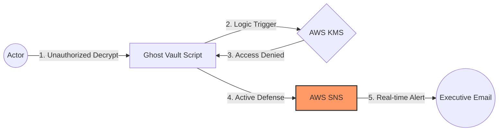
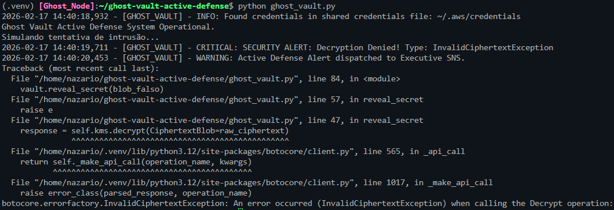
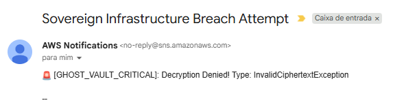

# Ghost Vault: Active Defense Infrastructure 🛡️

**Active Defense** is the tactical evolution of passive cloud monitoring. Traditional security models rely on post-incident analysis; the **Ghost Vault** focuses on real-time executive awareness.

## 🧠 The Philosophy
Infrastructure should "report itself". By using **AWS KMS** and **Python**, we've created a system where unauthorized access attempts don't just fail—they trigger immediate escalation to the management layer via **SNS**.

## 🛰️ Architectural Flow



## 🛠️ Technical Stack
* **Language**: Python 3.x
* **Encryption**: AWS KMS (Symmetric)
* **Alerting**: AWS SNS (SMS/Email)
* **Standard**: Hardened by Design™

## 🚀 Proof of Work (Validated)
The system is tested against real-world intrusion simulations. When the "tripwire" is touched, the response is instantaneous.

### 1. Terminal Reaction
The script identifies the `InvalidCiphertextException` and immediately dispatches the tactical alert.



### 2. Executive Notification
The "Secret Indicator" reaches the mailbox in seconds, bypassing traditional SOC bottlenecks.


*(Actual alert received during a simulated intrusion attempt)*

## 💎 Business Value
* **Instant Awareness**: Zero latency between breach attempt and executive notification.
* **Bypass Bureaucracy**: No more reliance on 40-page PDFs that gather digital dust.
* **Sovereign Control**: Independent validation of infrastructure status.

## 💻 How to Execute
To maintain security standards, sensitive ARNs are handled via environment variables.

### 1. Set Environment Variables
```bash
export GHOST_SNS_TOPIC_ARN='arn:aws:sns:us-east-1:072134156302:Ghost-Sovereign-Alerts'
export GHOST_KMS_ALIAS='alias/ghost-protocol-key'
```

### 2. Run the Engine
```bash
python ghost_vault.py
```
---
"Solving Complex Problems with Elegance & Without Drama."
[LinkedIn](https://www.linkedin.com/in/thiagonazario/)
